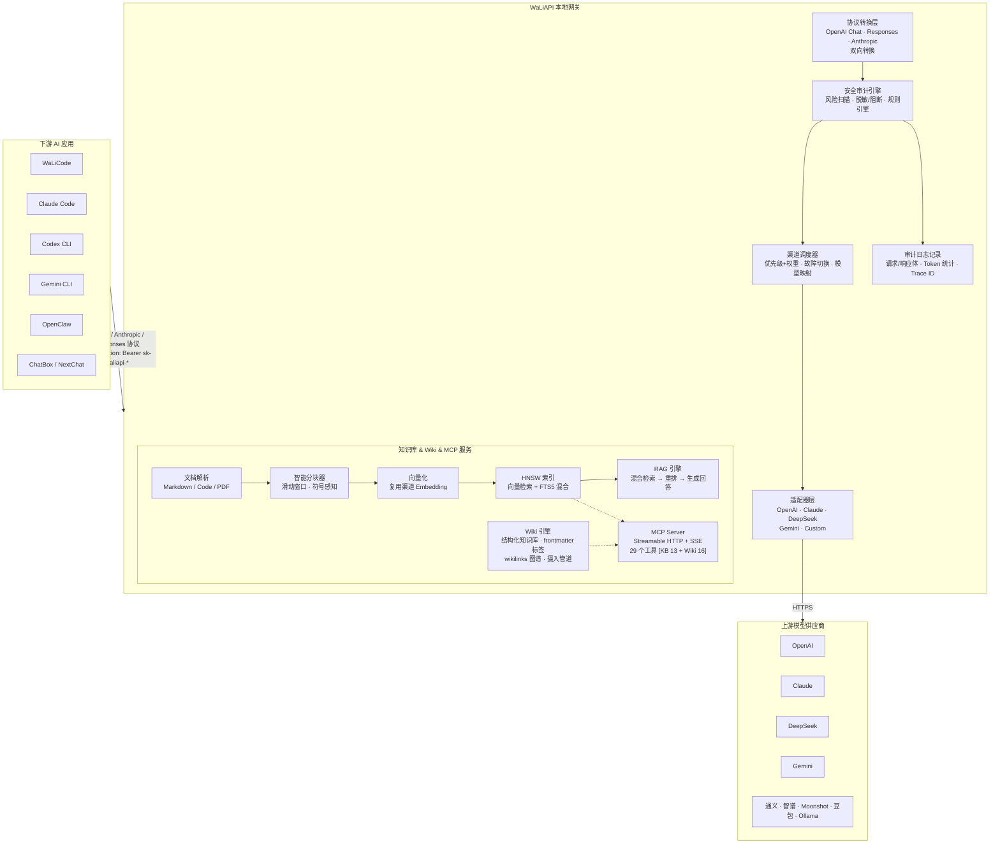
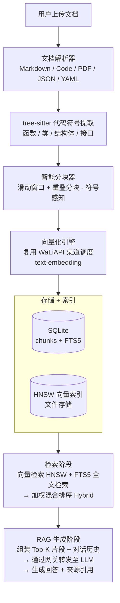
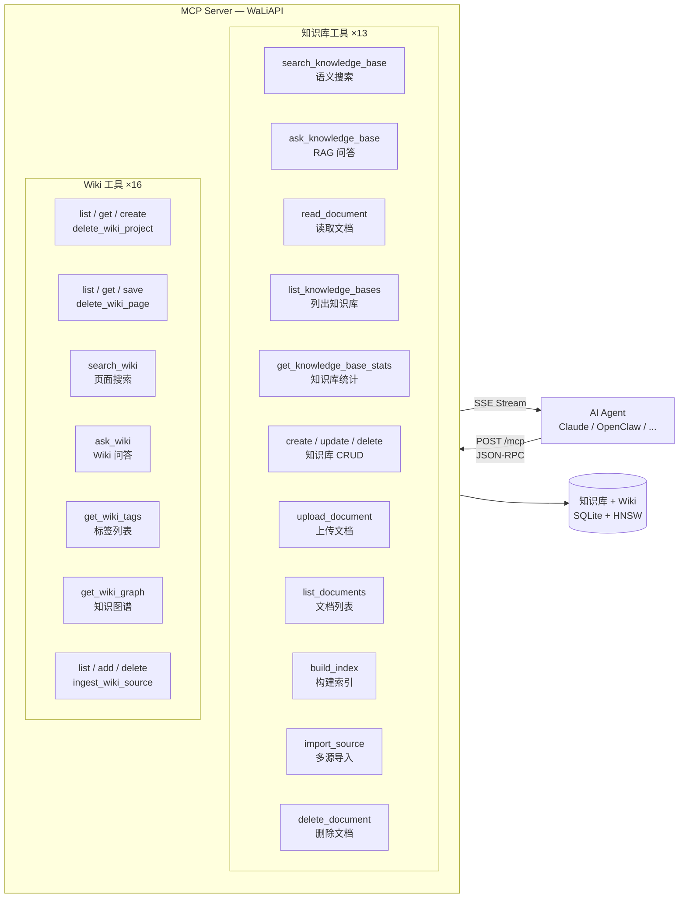

<div align="center">

# WaLiAPI

### 本地 LLM API 网关 · 多协议接入 · 知识库 RAG · MCP 工具服务

[](./src-tauri/tauri.conf.json)
[](./LICENSE)
[](#-安装使用)
[](https://tauri.app)

</div>

> **WaLiAPI** 是一款本地运行的 LLM API 网关桌面软件。它将多个上游模型供应商（OpenAI、Claude、DeepSeek、Gemini……）统一为 OpenAI 兼容协议，配合 [WaLiCode](https://walicode.xiaofuge.cn/)、Codex、Claude Code、Gemini CLI、OpenClaw 等 AI 编程工具使用，让你清楚知道 AI 对话到底在说什么。 ⭐️ 推荐 LLM 套餐(Kimi K3)：[https://mp.weixin.qq.com/s/jb2YzxFLNhIhjW5EONLcDA](https://mp.weixin.qq.com/s/jb2YzxFLNhIhjW5EONLcDA)

- Github：[https://github.com/fuzhengwei/WaLiAPI](https://github.com/fuzhengwei/WaLiAPI)
- Gitcode：[https://gitcode.com/fuzhengwei/WaLiAPI](https://gitcode.com/fuzhengwei/WaLiAPI)

---

## 📑 目录

- [贡献者](#-贡献者)
- [工作原理](#-工作原理)
- [核心功能](#-核心功能)
- [多协议接入](#-多协议接入)
- [技术栈](#-技术栈)
- [安装使用](#-安装使用)
- [项目结构](#-项目结构)
- [版本历史](#-版本历史)
- [许可证](#-许可证)

---

## 👥 贡献者

> WaLiAPI 由一个热情的开源社区共同构建。感谢以下开发者的代码贡献（按贡献量排序）。

<div align="center">

| | 贡献者 | GitHub | 提交 | 代码变更 | 主要贡献 |
|:---:|:---|:---|:---:|:---|:---|
| 🏆 | **小傅哥** | [@fuzhengwei](https://github.com/fuzhengwei) | 234 | `+75,320 / -15,431` | 项目创建者 · 核心架构 · 多渠道网关 · 协议转换 · 安全审计 · 知识库引擎 · Wiki 知识引擎 · MCP Server |
| ⚡ | **xian** | [@zsxink](https://github.com/zsxink) | 128 | `+92,693 / -23,802` | Anthropic Messages 协议兼容 · 渠道协议重构（T01-T14）· codec 加固 · SSRF 防护 · SSE 帧重组 · models 接口 · Kimi Code Auth · protocol 模块结构化重构 |
| 🔧 | **mw** | [@maowei0427](https://github.com/maowei0427) | 6 | `+1,105 / -197` | 日志响应内容记录 · Trace ID 追踪 · 详情页体验优化 · 知识库 embedding 批次配置 |
| 🐛 | **lianggq** | [@GQingL](https://github.com/GQingL) | 1 | `+91 / -9` | 日志日期筛选修复 · macOS 渠道删除按钮修复 |

</div>

---

## 🧭 工作原理

WaLiAPI 作为本地网关，在下游 AI 应用和上游模型供应商之间做协议翻译、负载均衡、安全审计和日志记录。同时内置知识库引擎、Wiki 知识引擎和 MCP Server，让 AI Agent 能直接检索私有知识。

### 请求转发流程



### 知识库 RAG 流程



### MCP 工具服务

WaLiAPI 内置 MCP (Model Context Protocol) Server，通过 Streamable HTTP + SSE 端点对外暴露 **29 个工具**（知识库 13 个 + Wiki 16 个），任何支持 MCP 的 AI Agent 均可接入：



---

## 🎯 核心功能

### 🔌 多渠道管理

- 支持 **10 种渠道类型**：OpenAI、DeepSeek、Claude、Gemini、智谱、通义、Moonshot、豆包、Ollama 及自定义渠道
- 优先级 + 权重的负载均衡策略，自动故障切换
- **多 Key 负载均衡**：单个渠道可配置多个 API Key，每个 Key 独立设置权重，请求按权重随机选择 Key 转发，分散单渠道并发压力
- **渠道复制**：一键复制现有渠道配置，快速创建相似渠道，免去重复配置
- 模型映射（渠道级别 model mapping），下游模型名自动映射到上游实际模型
- 渠道连通性测试，实时显示延迟与错误信息
- 渠道统计：调用次数、Token 消耗、成功率、平均延迟

### 🔑 密钥管理

- 为下游应用生成 `sk-waliapi-*` 格式的本地访问密钥
- 支持配额限制与启用/禁用
- 每个密钥展示调用次数、成功率、Token 消耗、平均延迟

### 📊 仪表盘

- 6 项核心指标一目了然：今日请求、今日 Token、累计请求、累计 Token、活跃渠道、平均延迟
- 服务可用率徽章，颜色分级（绿/黄/红）实时反映健康度
- 运维建议根据当前数据动态生成（延迟超阈值建议排查、渠道不足建议启用等）

### 📝 审计日志

- 完整记录每次 API 调用：请求体、响应体、模型参数、工具调用、Token 消耗、状态码
- 支持按关键词、密钥、渠道、模型、日期范围、Trace ID 搜索筛选
- 请求/响应 JSON 标签页切换，Trace ID 默认折叠可展开
- 日志编号自增，方便定位与引用
- **自动刷新**：页面可见时每 5 秒静默轮询，新日志自动出现，无需手动刷新
- 日志清理：按日期删除 / 一键清空

### 🛡️ 安全审计中心

- **风险检测引擎**：自动扫描请求中的敏感信息泄露（API Key、私钥、JWT、Cookie、Bearer Token）、敏感文件路径（`~/.ssh`、`.env`、云凭据）、Unicode 隐写字符（零宽字符、方向控制字符）、可疑工具调用（`curl` 外联、管道上传）、网络风险（公网 IP 探测、Webhook/隧道域名）、追踪像素与风控指纹
- **风险等级**：clean / info / low / medium / high / critical，综合评分 0–100
- **策略模式**：只审计 / 警告 / 脱敏 / 阻断，默认只审计不影响请求
- **规则管理**：内置 25+ 条风险规则 + 自定义黑白名单（域名/工具/路径/关键词）

### 📚 知识库引擎

- **文档解析**：Markdown、代码文件（TS/JS/Python/Rust/Go/Java 等 20+ 语言）、PDF、JSON/YAML/CSV
- **代码符号感知**：基于 tree-sitter 提取函数、类、结构体等符号信息，分块时保留语义边界
- **智能分块**：滑动窗口 + 重叠分块，符号感知避免截断函数体
- **向量化**：复用 WaLiAPI 渠道调度获取 Embedding，无需额外配置
- **HNSW 向量索引**：轻量级分层导航小世界图，O(log n) 检索复杂度，适合桌面级数据量（≤100K 切片）
- **FTS5 混合检索**：向量语义检索 + SQLite FTS5 全文检索加权融合，支持三种模式（向量 / 关键词 / 混合）
- **RAG 问答**：检索 Top-K 片段 + 对话历史 → 网关转发至 LLM → 生成回答 + 来源引用
- **多源导入**：Git 仓库克隆导入、URL 批量导入、本地目录扫描导入
- **会话管理**：按知识库维度的对话历史记录与清除

### 📓 Wiki 知识引擎

- **结构化知识库**：以项目为单位组织 Wiki，页面按 Markdown + frontmatter 管理，支持目录层级
- **文档摄入管道**：源文件解析 → 结构化页面生成 → 自动提取 frontmatter 标签和 `[[wikilinks]]` → 摄入状态机（pending / ingested / failed）
- **页面管理**：CRUD 操作、按路径/标题/内容搜索、按标签筛选
- **Wiki 问答**：检索相关页面 → LLM 生成回答 + 来源引用
- **知识图谱**：页面（节点）+ wikilinks（边）构成图谱，可视化知识关联
- **标签体系**：从 frontmatter 自动提取标签，按频率排序
- **多源管理**：Wiki 源文件列表、添加、删除、摄入

### 🔗 MCP Server

- 内置 Model Context Protocol Server，通过 `/mcp` 端点对外提供 **29 个工具**（知识库 13 + Wiki 16）
- 支持 Streamable HTTP（POST JSON-RPC）和 SSE（GET 升级）两种传输模式
- 兼容 Claude Desktop、OpenClaw 等支持 MCP 协议的 AI Agent
- **知识库工具**（13 个）：搜索、RAG 问答、读取文档、知识库 CRUD、文档上传/删除、索引管理、多源导入
- **Wiki 工具**（16 个）：项目 CRUD、页面 CRUD、搜索、问答、标签、图谱、源文件管理、摄入

### ⚙️ 设置中心

- Tab 切换式布局：安全审计 / 服务配置 / 通用设置 / 界面设置 / 重试策略
- 深色 / 浅色 / 跟随系统主题切换
- 最小化到托盘、关闭到托盘、开机自启
- 失败自动重试策略配置（默认 2 次）

### 🔧 应用配置

- 一键将 WaLiAPI 网关地址和密钥写入 8 款 AI 编程工具的配置文件：
  Claude Code、Codex CLI、Gemini CLI、Claude Desktop、OpenCode、OpenClaw、Hermes Agent、WaLiCode
- 自动检测已安装应用，支持配置预览、写入、清除、打开配置目录

### 📦 导入导出

- 渠道配置批量导出为 JSON 备份
- 支持导入 WaLiCode 备份文件恢复渠道配置

### 📡 流式响应

- 完整 SSE 流式转发，兼容 ChatBox / NextChat / OpenAI SDK 等下游客户端
- 流式使用量解析（累积 input/output tokens）

---

## 🔗 多协议接入

WaLiAPI 在网关层做协议翻译，入口多协议，出口统一为 OpenAI Chat Completions，上游渠道无感知。

| 协议 | 端点 | 认证方式 | 说明 |
|:---|:---|:---|:---|
| **OpenAI Chat Completions** | `POST /v1/chat/completions` | `Authorization: Bearer sk-waliapi-*` | 标准兼容协议，支持流式 |
| **OpenAI Responses** | `POST /v1/responses` | `Authorization: Bearer sk-waliapi-*` | Responses API 双向转换 |
| **Anthropic Messages** | `POST /v1/messages` | `x-api-key: sk-waliapi-*` | Anthropic 协议，自动头转换 |
| **OpenAI Embeddings** | `POST /v1/embeddings` | `Authorization: Bearer sk-waliapi-*` | 向量嵌入，知识库复用 |
| **模型列表** | `GET /v1/models` | `Authorization: Bearer sk-waliapi-*` | 聚合所有启用渠道的模型 |
| **健康检查** | `GET /health` | 无 | 服务存活探针 |
| **MCP** | `POST /mcp` / `GET /mcp` | — | MCP Streamable HTTP + SSE |
| **知识库 API** | `/api/kb/*` | — | 知识库 CRUD、搜索、RAG |

接入示例（以 OpenAI 协议为例）：

```bash
curl http://127.0.0.1:8777/v1/chat/completions \
  -H "Authorization: Bearer sk-waliapi-xxxx" \
  -H "Content-Type: application/json" \
  -d '{
    "model": "gpt-4o",
    "messages": [{"role": "user", "content": "Hello!"}]
  }'
```

接入示例（以 Anthropic 协议为例）：

```bash
curl http://127.0.0.1:8777/v1/messages \
  -H "x-api-key: sk-waliapi-xxxx" \
  -H "anthropic-version: 2023-06-01" \
  -H "Content-Type: application/json" \
  -d '{
    "model": "claude-sonnet-4-20250514",
    "max_tokens": 1024,
    "messages": [{"role": "user", "content": "Hello!"}]
  }'
```

> 💡 在「接入示例」页面可查看 cURL / Python / Node.js / TypeScript / Rust / Java 共 5 平台 × 3 协议 = 15 套代码示例。

---

## 🏗️ 技术栈

| 层 | 技术 | 版本 |
|:---|:---|:---|
| 前端 | React + TypeScript + Vite + Tailwind CSS + Zustand | 19 / 5.x / 7 / 4 / 5 |
| 后端 | Rust + Tauri 2 + Axum + SQLite (sqlx) + Reqwest | Edition 2021 |
| UI | shadcn/ui 风格 + Lucide Icons + React Router 7 | — |
| 知识库 | tree-sitter (7 语言) + HNSW + FTS5 + bincode | — |
| Wiki | Markdown + frontmatter 解析 + wikilinks 图谱 + SQLite | — |
| 打包 | Tauri bundler（.dmg / .msi / .deb / .AppImage） | 2.x |

---

## 📦 安装使用

### 1. 下载安装包

从 GitHub Releases 或网盘下载对应平台安装包：

- GitHub: [https://github.com/fuzhengwei/WaLiAPI/releases](https://github.com/fuzhengwei/WaLiAPI/releases)
- 网盘: [https://drive.weixin.qq.com/s?k=ACMA4AfQABU4S23jg8#/](https://drive.weixin.qq.com/s?k=ACMA4AfQABU4S23jg8#/)

| 平台 | 格式 | 架构 |
|:---|:---|:---|
| macOS | `.dmg` | ARM64 (Apple Silicon) |
| Windows | `.msi` / `.exe` | x64 |
| Linux | `.deb` / `.AppImage` | x64 |

### 2. 配置渠道

打开 WaLiAPI →「渠道管理」→「新建渠道」→ 填写名称、Base URL、API Key、支持的模型 → 保存。

### 3. 创建密钥

「API 密钥」→「新建密钥」→ 生成 `sk-waliapi-*` 格式的本地访问令牌。

### 4. 下游接入

在 ChatBox / NextChat / OpenAI SDK / WaLiCode 中配置：

- **Base URL**: `http://127.0.0.1:8777/v1`
- **API Key**: 创建的 `sk-waliapi-...` 密钥

### 5. 应用配置（可选）

在「应用配置」页面选择已安装的 AI 编程工具，一键写入网关地址和密钥，无需手动编辑配置文件。

### Linux Web 部署（Docker，推荐）

Linux Web 版本由同一个 Rust 服务提供 API 和 `dist/` 静态资源，适合放在一台 Linux 服务器上长期运行。Docker 构建是多阶段构建：Node/pnpm 编译前端，Rust 编译 `waliapi-server`，运行时使用非 root 用户；SQLite 数据持久化在 `/data`。

```bash
git clone https://github.com/fuzhengwei/WaLiAPI.git
cd WaLiAPI
export WALIAPI_ADMIN_TOKEN="$(openssl rand -hex 32)"
export WALIAPI_MCP_TOKEN="$(openssl rand -hex 32)"
docker compose up -d --build
curl http://127.0.0.1:8777/health
```

可选地将 `WALIAPI_PORT` 设置为其他端口。Compose 默认只发布到宿主机 `127.0.0.1`；生产环境不要使用示例 token，也不要把管理端口直接暴露到公网。用 Caddy（见 [`deploy/caddy/Caddyfile.example`](deploy/caddy/Caddyfile.example)）或 Nginx 终止 HTTPS 后反代到 `127.0.0.1:8777`。Caddy 配置域名后会自动申请和续期证书。

Web 管理面、MCP 和 `/v1` 数据面使用三个互不通用的凭证域：后台管理与 KB/Wiki REST 使用 `WALIAPI_ADMIN_TOKEN`，外部 Agent 的 `/mcp` 使用权限隔离的 `WALIAPI_MCP_TOKEN`，数据面使用后台创建的 `sk-waliapi-*` 密钥。两个环境变量令牌均要求至少 32 个字符且必须不同；所有管理/服务路由都不继承数据面的宽松 CORS。反向代理只负责 TLS 和转发，不得移除或绕过认证头。建议在防火墙中仅开放 HTTPS 端口。

Web 版提供与桌面版一致的业务能力：仪表盘、API/Auth 渠道、下游密钥、日志与安全规则、知识库、Wiki、MCP、Skills、导入导出、服务器侧应用配置以及全部路由/重试设置。浏览器文件选择、下载和进度事件分别由浏览器文件 API、下载和认证 SSE 适配。Linux 进程相关能力采用部署等价语义：监听地址/端口由 `WALIAPI_HOST` / `WALIAPI_PORT` 控制，自启动和更新由 systemd、Docker 与 GitHub Release 管理。

远程 Codex OAuth 完成授权后若浏览器无法打开 `localhost:1455` 回调页，可复制地址栏中的完整回调 URL，粘贴回登录窗口完成令牌交换；也可直接上传 Codex `auth.json`。Kimi 使用设备码流程，不依赖本地回调。Web 的“本地目录扫描”和应用配置均指 Linux 服务器/容器文件系统：Docker 中先挂载目录，再填写容器内路径。生成的客户端配置默认持久化到 `/data/managed-home`；Wiki 页面与源文件统一持久化到 `WALIAPI_DATA_DIR/wiki`。设置 `WALIAPI_PUBLIC_URL=https://waliapi.example.com` 可让生成配置使用公网 HTTPS 地址。

#### GitHub Actions 发布

[`release-web.yml`](.github/workflows/release-web.yml) 可以直接生成两类 Linux Web 产物：

- `waliapi-web-<version>-linux-x86_64.tar.gz`：包含 `waliapi-server`、`dist/`、systemd 和 Caddy 示例；每次手动运行都会保存为 Workflow Artifact。
- `ghcr.io/<owner>/<repository>:<version>`：通过 GHCR 发布的 `linux/amd64` Docker 镜像。

推送 `web-v*` 标签会创建 GitHub Release、上传二进制包，并发布带版本号和 `latest` 标签的镜像：

```bash
git tag web-v0.2.1
git push origin web-v0.2.1
```

也可以从 Actions 页面手动运行；默认只构建和验证 Docker 镜像，勾选 `publish_image` 才会推送到 GHCR。工作流不需要、也不会读取管理员 token。镜像和二进制包都是无密钥的通用产物，必须在运行时注入：

```bash
export WALIAPI_ADMIN_TOKEN="$(openssl rand -hex 32)"
export WALIAPI_MCP_TOKEN="$(openssl rand -hex 32)"
docker run -d --name waliapi \
  -p 127.0.0.1:8777:8777 \
  -v waliapi-data:/data \
  -e WALIAPI_ADMIN_TOKEN \
  -e WALIAPI_MCP_TOKEN \
  ghcr.io/<owner>/<repository>:latest
```

直接运行二进制包时同样使用环境变量：

```bash
WALIAPI_ADMIN_TOKEN="$WALIAPI_ADMIN_TOKEN" \
WALIAPI_MCP_TOKEN="$WALIAPI_MCP_TOKEN" \
WALIAPI_WEB_DIR="$PWD/dist" \
./waliapi-server
```

#### 不使用 Docker：systemd

先执行 `pnpm build` 和 `cargo build --release --manifest-path src-tauri/Cargo.toml --bin waliapi-server`。将 release 二进制和前端 `dist/` 放到 `/opt/waliapi/`，创建 `waliapi` 系统用户。systemd 沙箱通过 `StateDirectory=waliapi` 创建并授权固定的数据目录 `/var/lib/waliapi`；若确需改到其他目录，必须同步修改 unit 的可写路径。

用仅 root 可读的权限安装环境文件，再填写管理员 token：

```bash
sudo install -Dm600 deploy/systemd/waliapi.env.example /etc/waliapi/waliapi.env
sudo chown root:root /etc/waliapi/waliapi.env
sudoedit /etc/waliapi/waliapi.env
```

然后安装服务：

```bash
sudo install -Dm644 deploy/systemd/waliapi.service /etc/systemd/system/waliapi.service
sudo systemctl daemon-reload
sudo systemctl enable --now waliapi
sudo systemctl status waliapi
```

无论采用 Docker 还是 systemd，都应保持单实例运行（SQLite 不支持多个写入实例共享同一数据目录）。定期在停机窗口或使用 SQLite 一致性备份方式备份 `/data`（systemd 部署为 `/var/lib/waliapi`），并在升级前保留可回滚副本。管理员 token、渠道密钥和数据库备份都属于敏感数据，应限制文件权限并通过 HTTPS 传输。

---

## 📁 项目结构

```
WaLiAPI/
├── src/                              # 前端源码
│   ├── pages/
│   │   ├── DashboardPage.tsx         # 仪表盘
│   │   ├── ChannelsPage.tsx          # 渠道管理
│   │   ├── AuthChannelsPage.tsx      # Auth 账号管理
│   │   ├── ApiKeysPage.tsx           # 密钥管理
│   │   ├── LogsPage.tsx              # 审计日志
│   │   ├── KnowledgeBasePage.tsx     # 知识库 + Wiki + MCP 服务
│   │   ├── UsagePage.tsx             # 接入示例
│   │   ├── SettingsPage.tsx          # 设置中心
│   │   └── AppConfigPage.tsx        # 应用配置
│   ├── components/                   # 通用组件
│   │   ├── ChannelForm.tsx           # 渠道表单
│   │   ├── ImportDialog.tsx          # 导入对话框
│   │   ├── MappingSection.tsx        # 模型映射组件
│   │   ├── UpdateChecker.tsx         # 应用更新检查
│   │   ├── auth/                     # Auth 账号组件
│   │   ├── channel-form/             # 渠道表单子组件
│   │   └── layout/                   # 布局组件
│   ├── hooks/                        # 自定义 Hooks
│   ├── lib/                          # 工具库 (api.ts, constants.ts)
│   └── types/                        # TypeScript 类型定义
├── src-tauri/                        # 后端源码
│   ├── src/
│   │   ├── server/                   # HTTP 服务器
│   │   │   ├── router.rs             # 路由定义 (含服务注册)
│   │   │   └── handlers.rs            # 请求处理器
│   │   ├── adaptor/                  # 渠道适配器
│   │   │   ├── mod.rs                # Adaptor Trait + 配置
│   │   │   ├── openai.rs             # OpenAI 适配器
│   │   │   ├── claude.rs             # Claude 适配器
│   │   │   ├── deepseek.rs           # DeepSeek 适配器
│   │   │   ├── gemini.rs             # Gemini 适配器
│   │   │   └── custom.rs            # 自定义适配器
│   │   ├── protocol/                 # 协议转换层 (v0.2.1 结构化重构)
│   │   │   ├── mod.rs                # 双向格式转换
│   │   │   ├── sse_bridge.rs         # SSE 流桥接 (字节级重组 · CJK 安全)
│   │   │   ├── codec/                # 编解码器 (目录化)
│   │   │   │   ├── chat/             # Chat 协议编解码
│   │   │   │   ├── messages/         # Anthropic Messages 编解码
│   │   │   │   ├── responses_codec/  # Responses API 编解码
│   │   │   │   └── directions/       # 跨协议方向转换
│   │   │   │       ├── messages_to_responses/
│   │   │   │       └── responses_to_messages/
│   │   │   └── responses.rs          # Responses SSE 流式
│   │   ├── core/                     # 核心逻辑
│   │   │   ├── proxy.rs              # 代理转发 + 安全扫描 + 重试
│   │   │   ├── dispatcher.rs         # 渠道调度 (优先级/权重/故障切换)
│   │   │   ├── endpoint_executor/    # 端点执行器
│   │   │   │   ├── driver.rs         # 请求驱动 (日志写入/重试/流式)
│   │   │   │   ├── sse.rs            # SSE 流处理
│   │   │   │   └── estimate_usage.rs # Token 用量估算
│   │   │   └── auth_provider/        # Auth 账号管理
│   │   │       ├── service.rs        # Auth 服务
│   │   │       ├── maintenance.rs    # Token 维护/刷新
│   │   │       ├── codex_login.rs    # Codex 登录流程
│   │   │       ├── codex_backend.rs  # Codex 后端对接
│   │   │       ├── kimi_login.rs     # Kimi 设备 OAuth 登录
│   │   │       ├── kimi_backend.rs   # Kimi 后端对接
│   │   │       ├── spec.rs           # Provider 元数据与协议快照
│   │   │       └── types.rs          # Auth 通用类型
│   │   ├── security/                 # 安全审计
│   │   │   ├── scanner.rs            # 风险扫描引擎
│   │   │   ├── rules.rs              # 规则定义
│   │   │   ├── redact.rs             # 脱敏处理
│   │   │   └── mod.rs                # 安全设置
│   │   ├── services/                 # 服务层
│   │   │   ├── mod.rs                # Service Trait + 注册表
│   │   │   ├── knowledge/            # 知识库服务
│   │   │   │   ├── parser.rs         # 文档解析 (MD/Code/PDF/JSON)
│   │   │   │   ├── code_parser.rs    # tree-sitter 代码符号提取
│   │   │   │   ├── splitter.rs       # 智能分块器
│   │   │   │   ├── embedder.rs       # 向量化 (复用渠道调度)
│   │   │   │   ├── index.rs          # HNSW 向量索引
│   │   │   │   ├── retriever.rs      # 混合检索 (HNSW + FTS5)
│   │   │   │   ├── rag.rs            # RAG 问答引擎
│   │   │   │   ├── processor.rs      # 文档处理流水线
│   │   │   │   ├── importer.rs       # 多源导入 (Git/URL/目录)
│   │   │   │   ├── repository.rs     # 数据访问层
│   │   │   │   └── routes.rs         # 知识库路由
│   │   │   ├── wiki/                 # Wiki 知识引擎
│   │   │   │   ├── mod.rs            # WikiService 定义
│   │   │   │   ├── models.rs         # 数据模型 (Project/Page/Source)
│   │   │   │   ├── repository.rs     # 数据访问层
│   │   │   │   ├── project.rs        # 项目目录管理
│   │   │   │   ├── ingest.rs         # 文档摄入管道 (frontmatter/wikilinks)
│   │   │   │   ├── handlers.rs       # Wiki 请求处理器
│   │   │   │   └── routes.rs         # Wiki 路由
│   │   │   └── mcp/                  # MCP Server
│   │   │       ├── mod.rs            # MCP Service 定义
│   │   │       └── handlers.rs       # JSON-RPC 工具处理 (29 个工具)
│   │   ├── commands/                 # Tauri Commands
│   │   │   ├── channel.rs            # 渠道管理
│   │   │   ├── api_key.rs            # 密钥管理
│   │   │   ├── auth.rs              # Auth 账号管理
│   │   │   ├── log.rs                # 日志管理
│   │   │   ├── stats.rs              # 统计数据
│   │   │   ├── settings.rs           # 设置管理
│   │   │   ├── security.rs           # 安全规则
│   │   │   ├── knowledge_base.rs     # 知识库命令
│   │   │   ├── wiki.rs              # Wiki 命令
│   │   │   ├── services.rs           # 服务状态
│   │   │   ├── app_config.rs         # 应用配置 (8 款工具)
│   │   │   ├── import_export.rs      # 导入导出
│   │   │   └── server.rs             # 服务控制
│   │   ├── db/                       # 数据库层
│   │   │   ├── mod.rs                # Database 初始化
│   │   │   ├── models.rs             # 数据模型
│   │   │   └── repository.rs         # 数据访问
│   │   ├── utils/                    # 工具函数
│   │   ├── channel_presets.rs        # 渠道预设注册表
│   │   ├── lib.rs                    # 入口 + 系统托盘
│   │   └── main.rs                   # main 函数
│   ├── migrations/                   # 数据库迁移 (23 个)
│   └── tauri.conf.json               # Tauri 配置
└── package.json
```

---

## 📌 版本历史

### v0.2.1 (2026-08-18)

#### 协议转换层结构化重构

- 🔧 **protocol 模块目录化**：将 protocol 根转换逻辑拆分为独立子模块——codec/chat、codec/messages、codec/responses_codec、directions（messages_to_responses / responses_to_messages），每个方向独立 encode/decode/stream/test，消除 1500 行巨型文件
- 🔧 **死代码清理与 API 收敛**：清理 protocol 模块遗留 API 和死代码，clippy 告警归零，完成模块结构与 re-export 审计
- 🔧 **codec 加固**：移植 tool-call 回放保留空 reasoning_content 兼容性优化，修复测试编译问题，全仓 cargo fmt 格式化

#### Kimi Code Auth 账号接入

- ✨ **Kimi 设备 OAuth 登录**：实现 Kimi 设备授权流程（device code → 授权 → token），支持 token 自动刷新
- ✨ **Provider 中立认证框架**：新增 provider metadata + model protocol snapshot，支持多登录方式扩展
- ✨ **认证路由集成**：model-level auth profiles 传入 prepared attempts，executor 注册 Kimi 认证尝试
- ✨ **登录会话管理**：provider-neutral login sessions and commands，通用 login context 与 locked replacement 持久化
- ✨ **协议感知模型发现**：Kimi 后端协议感知的模型发现与注册
- ✨ **前端 Auth 面板**：Kimi auth login UI + provider-aware accounts 页面
- 🐛 **402 订阅无效终态处理**：402 订阅无效分为终态，不再 12h 死循环重试
- 🐛 **令牌失效原因记录**：invalidation_reason 记录并透出到 DTO，失效账号卡片显示具体失效原因
- 🐛 **渠道页账号过滤修复**：渠道页按 provider 过滤账号卡片，不再混显
- ✅ **测试覆盖**：Kimi routing replacement refresh 与协议流程测试

#### 审计日志流式响应修复

- 🐛 **流式响应内容记录修复**：流式请求的审计日志中 `response_choices` 字段此前始终为空，现已正确记录响应内容（content / reasoning_content / tool_calls），与非流式路径行为一致
- 🔧 **多协议流式累积**：新增 SSE 事件解析器，支持三种流式协议的响应内容累积：
  - OpenAI Chat Completions（`choices[].delta.content` / `reasoning_content` / `tool_calls`）
  - Anthropic Messages（`content_block_delta` 的 `text_delta` / `thinking_delta` / `input_json_delta`）
  - OpenAI Responses API（`response.output_text.delta` / `response.completed`）
- 🔧 **StreamPumpCore 扩展**：新增 `accumulated_reasoning`、`response_role`、`finish_reason`、`tool_calls_map` 字段，`build_response_choices()` 方法从累积内容构建标准 JSON

#### 其他

- 121 个文件变更，+22,616 / -14,462 行代码
- 版本号统一升级至 0.2.1（package.json / Cargo.toml / tauri.conf.json）

### v0.1.9 (2026-08-13)

#### 渠道多 Key 负载均衡

- ✨ **多密钥负载**：渠道支持配置多个 API Key，每个 Key 独立设置权重，请求按权重随机选择 Key 转发，自动分散单渠道的并发压力
- ✨ **Key 状态管理**：每个 Key 可独立启用/禁用，禁用的 Key 不参与负载选择
- ✨ **主 Key + 扩展 Key**：渠道原有的 `api_key` 作为主 Key（使用渠道级 weight），额外 Key 通过 `channel_api_keys` 表管理（migration 023），两者共同参与加权随机选择
- ✨ **全链路覆盖**：proxy.rs 和 endpoint_executor/driver.rs 两条转发路径均已接入多 Key 选择逻辑

#### 渠道复制快捷配置

- ✨ **一键复制渠道**：渠道卡片操作栏新增复制按钮，点击后进入新建表单并预填充原渠道所有配置（名称加 `(副本)` 后缀，密钥清空待填），免去重复配置的繁琐操作

#### 审计日志体验优化

- ✨ **审计日志自动刷新**：页面可见时每 5 秒静默轮询，新日志自动出现，无需手动刷新。页面切到后台时不轮询，切回前台自动恢复；静默刷新不触发 loading 动画，不干扰用户操作

#### 自动更新体验优化

- ✨ **Release Notes 动态化**：自动更新弹窗中的版本说明从 CHANGELOG.md 自动提取，不再显示固定文案。四个 CI workflow（macOS ARM64/Intel、Windows、Linux）均已接入

### v0.1.8 (2026-08-12)

#### API 密钥管理增强

- ✨ **密钥编辑功能**：支持编辑密钥名称、配额、白/黑名单规则（key 不可编辑）
- ✨ **白名单/黑名单规则**：密钥级别渠道+模型访问控制，交互式下拉多选 + 笛卡尔积规则生成 + 去重
- ✨ **密钥编辑入口**：卡片操作栏新增编辑按钮，复用 ApiKeyForm 组件编辑模式

#### 路由与映射优化

- 🐛 **路由优先级修复**：关闭 `prefer_auth_accounts` 与 `prefer_same_protocol`，所有候选混同按 priority → weight 排序
- ✨ **Auth 账号模型映射**：`auth_accounts` 新增 `model_mapping_json` 列（migration 021），全链路支持映射名→实际模型名转换
- ✨ **映射逻辑统一重构**：前端抽取 `useModelMappings`/`MappingSection` 共用组件，后端抽取 `mapping_contains_source` 通用函数

#### Usage 页面与 LLM 应用

- ✨ **MODEL 下拉按密钥过滤**：选中 API Key 后，MODEL 列表自动按白/黑名单过滤（UsagePage + AppConfigPanel）
- ✨ **MODEL 下拉三分类**：API 渠道模型 / Auth 账号模型 / 映射模型三个 optgroup 分组展示
- ✨ **Auth 账号豁免渠道限制**：Auth 账号无 channel id，豁免渠道级白/黑名单，模型级限制仍生效
- ✨ **priority/weight 中文化**：AccountCard 与 EditModal 标签改为「优先级」「权重」

### v0.1.7 (2026-08-09)

#### Wiki 知识引擎（大功能）

- **数据模型**：Wiki 项目/页面/源文件三表结构（mig017 + mig018 标签表），项目目录隔离
- **文档摄入管道**：源文件解析 → 结构化页面生成 → 自动提取 frontmatter 标签和 `[[wikilinks]]` → 摄入状态机（pending / ingested / failed）
- **页面管理**：CRUD 操作、按路径/标题/内容搜索、按标签筛选
- **Wiki 问答**：检索相关页面 → LLM 生成回答 + 来源引用
- **知识图谱**：页面（节点）+ wikilinks（边）构成图谱，支持可视化
- **标签体系**：从 frontmatter 自动提取标签，按频率排序
- **前端面板**：KnowledgeBasePage Wiki 面板（项目/页面/搜索/问答/标签/图谱视图），Sidebar 导航，Dashboard 统计

#### MCP Server 扩展

- 新增 **16 个 Wiki MCP 工具**：项目 CRUD、页面 CRUD、搜索、问答、标签、图谱、源文件管理、摄入
- MCP 工具总数从 13 → **29 个**（知识库 13 + Wiki 16）
- Dashboard 新增 Wiki 统计卡片，指标分两行展示（5+5）

#### SSE 协议修复

- **SSE 字节级重组**：`sse_bridge.rs` 新模块，修复 CJK 多字节边界帧泄漏问题（push 改 `&[u8]`）
- **Responses 流式修复**：handler 路径 SSE 帧重组 + reasoning 归属修复
- **OpenAI Responses/Chat 协议对齐**：stop_reason 收敛 + done 补字段 + usage details
- **Opencode/Codex 流式修复**：bridge 统一 Anthropic→OpenAI SSE + usage 合并 + tools 转发
- **tool_choice 透传修复**：仅在转换出函数工具时透传并规范化到 Chat 格式
- **Anthropic Messages 转换修复**：system 提取 + tool_choice 映射 + stream_options

### v0.1.6 (2026-08-08)

#### 渠道协议大重构（T01–T14）

- **T01** — Provider preset registry + 领域类型定义，统一渠道身份模型
- **T02** — 渠道身份迁移和 resolver，修复 review findings
- **T03** — 零调用 fail-closed 测试、legacy 日志脱敏、安全审计门、dead-code 清理
- **T04** — chat↔messages 严格 codec，canonical tool_result，strict n/empty-stream，thread model
- **T07** — SSRF private-range 策略（按渠道）、stream:false 探测、SSE-always 网关容错、草稿测试跳过 count_tokens 探测
- **T08** — Provider 下拉组件（分组、品牌 SVG 图标、键盘导航、a11y）、silent switch、free endpoint toggle、延迟显示两位小数、legacy 渠道显示推断协议标签
- **T10** — Feature flags 暴露给 UI（Tauri Command）
- **T11** — Codec 加固：image gate、field whitelist、tool validation；protocol rollout 集成测试；upstream model 采样写入 body
- **T12** — CLIProxyAPI codec baseline 对比
- **T13** — thinking/reasoning fail-open 转换（codec + legacy）
- **T14** — 通过 modal 同步上游模型（后端 fetch + 前端 apply）

#### 渠道表单 URL 预览

- 端点→请求路径模板常量 `ENDPOINT_PATHS`
- 端点下方实时展示实际请求 URL 预览，随输入更新
- URL 预览改纯文本靠左，隐藏 count_tokens 端点
- Anthropic base URL 统一自带 `/v1`，端点只补 `/messages`

#### /v1/models 接口

- 新增兼容 OpenAI + Anthropic 格式的 `/v1/models` 接口，聚合所有启用渠道的模型列表

#### 数据库迁移备份

- 迁移前自动备份数据库，保留最近 3 份

#### Provider 图标和预设更新

- 品牌 SVG 图标（Claude、Moonshot、Doubao 等）
- 渠道预设更新（名称、图标、端点、描述）

### v0.1.5 (2026-08-03)

- ✨ 模型映射一对多：`model_mapping` 支持单目标→多目标数组映射，同优先级渠道间随机负载均衡
- 🐛 输入法 composing 回车误触发修复：`isComposing` + `keyCode 229` 双重防护，覆盖 ChannelForm / ApiKeysPage / KnowledgeBasePage
- 🐛 渠道拖拽排序修复：Tauri v2 `dragDropEnabled` 吞掉 HTML5 drop 事件，禁用后拖拽排序正常
- 🐛 proxy.rs P0 修复：Chat Completions 路径 429/5xx 误返客户端，新增 `status >= 400` 检查触发 failover
- ✨ 渠道超时配置：`timeout_secs` 字段（默认 60s，可配 1~600s），覆盖 5 个适配器 + handlers 3 处请求
- ✨ ChannelForm UX 增强：映射 from 下拉（跨渠道通用映射名 + 添加新映射名入口）、优先级/权重说明文字
- 🐛 映射模型分组去重修复：UsagePage / AppConfigPage 拆分 `realSeen` / `mappedSeen` 独立去重
- ✨ LLM 使用页空配置提示：无密钥/无渠道时显示红色提示 + 快捷跳转链接
- ✨ 渠道卡片空白区域点击展开/收起

### v0.1.4 (2026-07-30)

- ✨ 知识库引擎：文档解析 → tree-sitter 代码符号感知 → 智能分块 → 向量化 → HNSW 索引
- ✨ 混合检索：HNSW 向量检索 + SQLite FTS5 全文检索加权融合，三种模式（向量/关键词/混合）
- ✨ RAG 问答引擎：Top-K 检索 + 对话历史 + 来源引用
- ✨ MCP Server：Streamable HTTP + SSE，13 个知识库工具，兼容 Claude Desktop / OpenClaw
- ✨ 多源导入：Git 仓库克隆、URL 批量导入、本地目录扫描
- ✨ 应用配置：一键写入 8 款 AI 编程工具配置（Claude Code / Codex / Gemini CLI / WaLiCode 等）
- ✨ 导入导出：渠道配置 JSON 备份 + WaLiCode 备份文件导入
- ✨ 内置应用更新检查（Tauri Updater）

### v0.1.1 (2026-07-21)

- ✨ 多协议网关：支持 OpenAI Chat Completions + Responses API + Anthropic Messages 三协议入口
- ✨ 仪表盘优化：统一 6 卡片指标网格 + 健康度徽章 + 动态运维建议
- ✨ 渠道统计：调用次数、Token 消耗、成功率、平均延迟
- ✨ 密钥统计：每个密钥的调用指标展示
- ✨ 接入示例页：三协议切换 + 15 套代码示例 + 连接测试

### v0.1.0 (2026-07-18)

- 🎉 首个发布版本
- 多渠道管理（10 种渠道类型）+ 优先级/权重负载均衡
- 密钥管理 + 配额限制
- 请求/响应日志 + 全维度搜索筛选
- 安全审计中心（25+ 规则，5 种策略模式）
- 设置中心（主题/托盘/自启/重试）
- SSE 流式响应转发

---

## 📄 License

[MIT](./LICENSE)

---

<div align="center">
  <sub>Built with ❤️ by the WaLiAPI community</sub>
</div>
